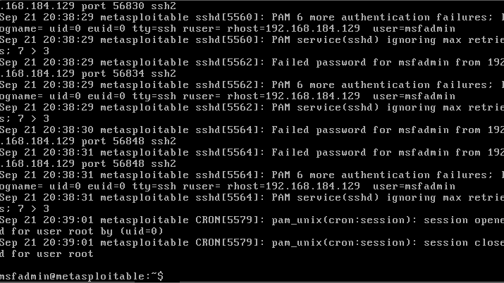
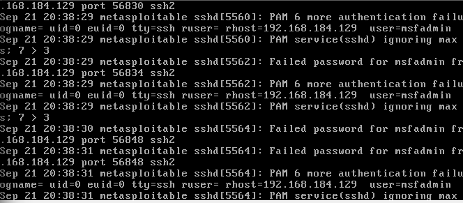

# SSH Brute-Force Attack Investigation — Metasploitable2 Home Lab

# 1. Executive Summary
On 21 September 2026, a brute-force authentication attack targeting the `msfadmin` SSH account on a Metasploitable2 host was detected and investigated in a controlled home lab environment. The attack originated from a Kali Linux VM using Hydra. This report documents the environment setup, detection process, log analysis, key findings, and remediation recommendations, following a standard SOC incident investigation format.

# 2. Environment
| Role | System | IP Address |
|---|---|---|
| Attacker | Kali Linux (VMware, host-only network) | 192.168.184.129 |
| Target | Metasploitable2 (VMware, host-only network) | 192.168.184.128 |

- Tool used: Hydra v9.7 (dictionary attack using `rockyou.txt`)
- Monitoring method: `/var/log/auth.log` tailed live on the target during the attack
- Note: SSH client on Kali required legacy KEX/MAC/cipher algorithms re-enabled (`diffie-hellman-group1-sha1`, `ssh-rsa`, `hmac-md5`/`hmac-sha1`) to negotiate with Metasploitable2's outdated OpenSSH server — itself a reminder of the real compatibility issues legacy infrastructure creates for both attackers and defenders.

# 3. Detection
Live monitoring of `/var/log/auth.log` on the target host showed a sudden spike of `Failed password for msfadmin` entries within a tight time window, originating from a single source IP across multiple sequential source ports — a pattern consistent with automated login attempts rather than manual human error.

# 4. Timeline & Evidence

Attack window: 21 Sep 2026, 20:38:29 – 20:39:01 (local log time)

Key log excerpt:
```
Sep 21 20:38:29 metasploitable sshd[55560]: PAM 6 more authentication failures; ... ruser= rhost=192.168.184.129 user=msfadmin
Sep 21 20:38:29 metasploitable sshd[55560]: PAM service(sshd) ignoring max retries; 7 > 3
Sep 21 20:38:29 metasploitable sshd[55562]: Failed password for msfadmin from 192.168.184.129 port 56834 ssh2
Sep 21 20:38:30 metasploitable sshd[55564]: Failed password for msfadmin from 192.168.184.129 port 56848 ssh2
Sep 21 20:38:31 metasploitable sshd[55564]: PAM 6 more authentication failures; ... ruser= rhost=192.168.184.129 user=msfadmin
Sep 21 20:38:31 metasploitable sshd[55564]: PAM service(sshd) ignoring max retries; 7 > 3
```

Screenshots:




# 5. Analysis
- Multiple failed login attempts for the same account (`msfadmin`) from the same source IP within under a minute
- Each attempt used a distinct source port (56830, 56834, 56848...) — consistent with automated/scripted login attempts rather than manual entry
- PAM explicitly logged that it was **ignoring** the configured max-retry threshold (`ignoring max retries: 7 > 3`), meaning a lockout control existed in configuration but was not being enforced in practice
- Unrelated `CRON[5579]` session entries appearing in the same log window were reviewed and ruled out as noise — not part of the incident

# 6. Indicators of Compromise (IOCs)
- Source IP: 192.168.184.129
- Targeted account: msfadmin
- Targeted service: sshd (port 22)
- Attack window: 20:38:29 – 20:39:01

# 7. Remediation Recommendations
- Correct the PAM configuration so the max-retry lockout is actually enforced, not just configured
- Implement automated IP blocking (e.g. `fail2ban`) to lock out source IPs after repeated failed attempts
- Apply rate limiting on SSH connection attempts
- Move from password-based SSH authentication to key-based authentication
- Consider restricting SSH access by source network/IP allowlist where feasible

# 8. Lessons Learned
This investigation highlighted that a security control existing on paper (PAM's configured max-retry lockout) is not the same as a security control actually functioning — the lockout threshold was set, but sshd ignored it, allowing the brute-force to continue unimpeded. This reinforces the importance of verifying that controls are enforced, not just configured. Key takeaways for hardening this environment: enforce PAM's max-retry lockout correctly, implement automated IP blocking (e.g. fail2ban) after repeated failures, apply rate limiting on SSH connection attempts, and move toward key-based SSH authentication instead of passwords entirely.

---
*Lab conducted in an isolated VMware host-only network for educational purposes only.*
